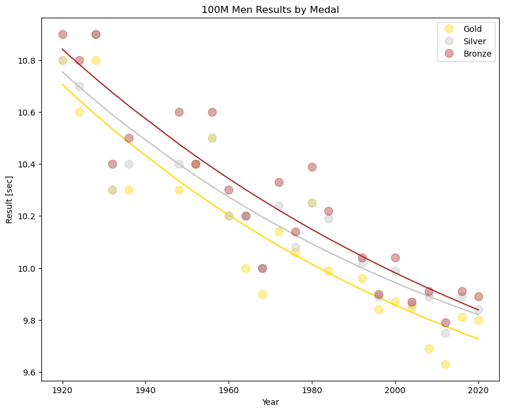

## Introduction
This notebook analyzes the performance trends in the men's and women's **100-meter and 200-meter dash** in the Summer Olympic Games. The goal is to understand:

* How fast each medalists' time is compared to the model's **expected result** for that Olympic year
* Which medalist **overperformed** their expected result the most compared to all other competitors in the same event
* To **predict** the expected result for Gold, Silver, and Bronze in the 2024 Olympic Games 100-meter and 200-meter dash

This notebook was forked and based on Omri Goldstein's work on [Kaggle](https://www.kaggle.com/code/drgilermo/ahead-of-their-time). The updates to his notebook are the following:

* Added results from the Summer 2020 Olympic Games
* Plotted the data and fitted an exponential curve for **each medal**
* Removed outlier results from early Summer Olympic Games to better fit model
* **Predicted** the results for the 2024 men's and women's 100-meter and 200-meter dash

For a more detailed analysis of this project, you can read my blog post on [Medium](https://medium.com/@randomforestforthetrees/ahead-of-their-time-using-regression-analysis-to-examine-and-predict-olympic-track-field-24685853b48e).

--

## 📁 Repository Structure

```
data/                 # cleaned results file (results_updated.csv)
notebooks/            # main analysis notebook
reports/
   figures/           # exported PNGs used in the README
src/                  # optional helper scripts
requirements.txt      # dependencies
README.md             # project documentation
```

---

## 🚀 How to Run

```bash
pip install -r requirements.txt
jupyter notebook notebooks/ahead_of_their_time_2024.ipynb
```

---

## ▶️ Open in Google Colab

[](
https://colab.research.google.com/github/mtchynkstff/olympic-sprinting/blob/main/notebooks/ahead_of_their_time_2024.ipynb)

---

## 📊 Data

- **Source**: Based on and extended from Omri Goldstein’s Kaggle dataset
- **File**: `data/results_updated.csv`
- **Fields include**:
  - Athlete name  
  - Country  
  - Event (100m, 200m)  
  - Gender  
  - Olympic year  
  - Medal  
  - Final time (seconds)

---

## 🧠 Methods

- Cleaned and extended original results dataset  
- Removed early-era outliers and incomplete records  
- Fit **exponential regression curves** for each event  
- Computed residuals to identify athletes significantly outperforming the era trend  
- Predicted medal-winning times for **2024**  
- Visualized trends and overperformers

---

## 🏅 Summary of Findings

- Sprint performance improves exponentially but has slowed in recent decades  
- Certain athletes were dramatically ahead of the curve (especially early years)  
- Predicted 2024 medal times using fitted trend lines  
- (Optional future update) Compare predictions to actual 2024 results

---

## 📈 Key Figures



---

## 🔧 Requirements

```
pandas>=2.1
numpy>=1.26
matplotlib>=3.8
scipy>=1.11
seaborn>=0.13
```

---

## 📌 Next Steps

- Add 2024 actual results to validate predictions  
- Add helper functions to `src/` for curve fitting and residual analysis  
- Extend to 400m or relay events  
- Show uncertainty intervals for model predictions  

---

_Last updated: 2025-11-14_
